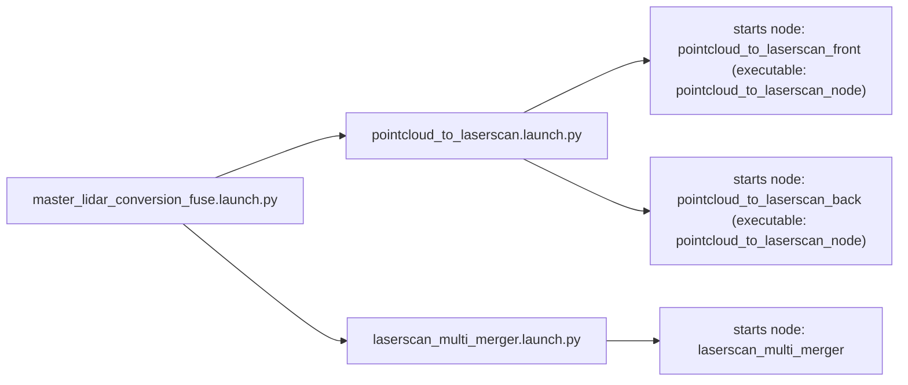

# perception_utils_ros2

`perception_utils_ros2` provides ROS 2 components and executables for combining multiple point cloud streams, saving the merged result to a PCD file, and replaying saved PCD files back into ROS 2.

## Launch Files

### `launch/cloud_multi_merger.launch.py`

Launches the `pointcloud_merger` executable with two point cloud inputs, `/VLP16_lidar_back/points` and `/VLP16_lidar_front/points`, and publishes their fused output on `/merged_cloud`.

Role in the package:

- Starts the package's point cloud fusion pipeline.
- Sets `VLP16_lidar_back` as the destination frame for the merged cloud.
- Provides a direct launch entry point when the goal is cloud fusion only.

### `launch/laserscan_multi_merger.launch.py`

Launches this package's `laserscan_multi_merger` node to fuse multiple input laser scans into a single scan topic and merged point cloud.

Role in the package:

- Starts `laserscan_multi_merger` executable.
- Accepts launch arguments for `destination_frame`, `cloud_destination_topic`, `scan_destination_topic`, and `laserscan_topics`.
- Publishes both a fused laser scan and a merged point cloud from the configured scan inputs.

### `launch/pointcloud_to_laserscan.launch.py`

Launches two `pointcloud_to_laserscan_node` instances, one for the front lidar and one for the back lidar, to convert point cloud topics into laser scan topics.

Role in the package:

- Converts `/<scanner>/points` topics into `/<scanner>/scan` topics.
- Applies per-node conversion parameters such as angle range, height filters, and range limits.
- Prepares scan topics for downstream fusion by `laserscan_multi_merger.launch.py`.

### `launch/master_lidar_conversion_fuse.launch.py`

Launches a higher-level pipeline by including two other launch files: one that converts point clouds to laser scans and one that merges those scans.

Role in the package:

- Chains `pointcloud_to_laserscan.launch.py` and `laserscan_multi_merger.launch.py`.
- Provides an end-to-end scan-fusion workflow starting from raw point cloud topics.
- Acts as the orchestration entry point for lidar conversion plus fusion.

### `launch/pcd_to_pointcloud.launch.py`

Launches `pcl_ros`'s `pcd_to_pointcloud` node to replay a stored `.pcd` file as a live `PointCloud2` topic.

Role in the package:

- Declares launch arguments for the PCD file path, TF frame, output topic, and publication period.
- Publishes recorded point cloud data back into ROS 2 for testing, replay, or visualization.
- Supports workflows where saved point cloud maps must be republished.
- Publishes on `/cloud_pcd` by default.
- The current default `pcd_file` still points to `concert_mapping`, so in practice you should pass an explicit `pcd_file:=...` argument.

### `launch/pointcloud_to_pcd.launch.py`

Launches the package's `pointcloud_to_pcd_node` so an incoming point cloud stream can be accumulated and exported as a `.pcd` file.

Role in the package:

- Starts the generated standalone executable for the `PointCloudToPCD` component.
- Remaps the input subscription to `/cloud_map`.
- Supports map capture or final cloud export from a merged point cloud stream.
- Uses `maps/pointclouds_` as the default output prefix, relative to the process working directory.
- Creates missing parent directories for the output path at runtime.

---

## Source Files

### `src/pointcloud_merger.cpp`

This file defines the `perception_utils::PointCloudMerger` component. Its responsibility is to subscribe to multiple `sensor_msgs/msg/PointCloud2` topics, transform each incoming cloud into a shared destination frame, cache the latest cloud from each topic, and publish one merged cloud.

How it works:

- The node declares three parameters:
  - `destination_frame`: target TF frame for all input clouds.
  - `cloud_destination_topic`: output topic for the merged cloud.
  - `pointcloud_topics`: whitespace-separated list of input topics.
- During startup it creates a TF2 buffer/listener pair and one subscription per configured input topic.
- Each callback transforms the incoming cloud into `destination_frame` with `pcl_ros::transformPointCloud`.
- The transformed cloud is stored as the latest sample for that topic.
- After every update, all non-empty cached clouds are concatenated into a single `pcl::PCLPointCloud2` and republished.

Typical use:

- Fuse multiple lidars or depth cameras into a single perception topic.
- Standardize all incoming clouds into one robot-centric frame before downstream processing.

### `src/pointcloud_to_pcd.cpp`

This file defines the `perception_utils::PointCloudToPCD` component. Its responsibility is to accumulate a stream of point clouds over time and write the full accumulated cloud to a single `.pcd` file. 
Features the service `/pointcloud_to_pcd/save_map` that enables map saving before node termination with custom filename.

How it works:

- The node subscribes to the `input` topic using a reliable, transient-local QoS so it can receive latched map topics such as `/cloud_map` from RTAB-Map even if it starts after the map was published.
- It can optionally transform each incoming cloud into a fixed TF frame before accumulation.
- It supports both `PointXYZ` and `PointXYZRGB` accumulation, selected with the `rgb` parameter.
- It stores all received points in memory until a save is triggered.
- Saving can happen:
  - when a wall timer expires (`save_timer_sec > 0`), or
  - when the node shuts down and `save_on_shutdown` is enabled.
- The output file format can be ASCII, binary, or binary compressed, depending on parameters.
- The generated file name is `prefix + "combined_<sec>_<nanosec>.pcd"`.
- Parent directories are created automatically before writing.
- Save failures are logged as runtime errors instead of aborting the process.

Main parameters:

- `prefix`: filename prefix for the generated `.pcd` file.
- `fixed_frame`: optional TF frame used to normalize all input clouds before accumulation.
- `binary`: enables binary PCD output.
- `compressed`: enables compressed binary output when `binary` is true.
- `rgb`: accumulates colored points (`PointXYZRGB`) instead of plain XYZ points.
- `save_on_shutdown`: saves automatically during node destruction if no save happened earlier.
- `save_timer_sec`: optional automatic save timer in seconds.

Typical use:

- Record a fused cloud from `pointcloud_merger` into a single PCD snapshot.
- Build a static scene capture from a moving sensor stream.
- Record an RTAB-Map `/cloud_map` topic after localization or mapping has already produced the latched map sample.
- Call `ros2 service call /pointcloud_to_pcd/save_map perception_utils_ros2/srv/SaveMap "{filename: 'my_map_snapshot'}"` to save the map before the natural termination of the node (when map saves automatically).

### `src/laserscan_multi_merger.cpp`

This file implements the `perception_utils::LaserscanMerger` node declared in `include/laserscan_multi_merger.hpp`. Its responsibility is to subscribe to multiple `sensor_msgs/msg/LaserScan` topics, project each scan into a point cloud, transform all clouds into a common frame, merge them, and then publish both a merged point cloud and a regenerated merged laser scan.

How it works:

- The node declares parameters for the destination frame, output topics, input scan topics, and the angular and range settings of the generated merged scan.
- It registers a parameter callback so scan-generation settings such as `angle_min`, `angle_max`, and `range_max` can be updated at runtime.
- It waits for the configured laser scan topics to appear on the ROS graph, then creates one subscription per input topic.
- Each input scan is projected to a point cloud with `laser_geometry::LaserProjection` and transformed into the common destination frame with TF2.
- The node caches one transformed point cloud per input topic and tracks whether each topic has produced a fresh update.
- Once all configured topics have contributed a fresh cloud, the clouds are concatenated, converted into an Eigen point matrix, and rasterized back into a single `LaserScan`.
- The merged laser scan is published first, followed by the merged point cloud.

Typical use:

- Fuse front and rear lidar scans into one 360-degree scan topic.
- Publish both a scan representation and a merged cloud representation of the same sensor set.

### Relationship Between the Files

These source files support three related perception workflows:

1. `pointcloud_merger.cpp` combines several live point cloud topics into one unified point cloud topic.
2. `pointcloud_to_pcd.cpp` subscribes to a point cloud topic and writes the accumulated result to disk.
3. `laserscan_multi_merger.cpp` combines several laser scan topics by projecting them into clouds, fusing them, and regenerating a single scan output.

This package therefore supports both point-cloud fusion and laser-scan fusion, with optional export of the fused cloud as a PCD file.
